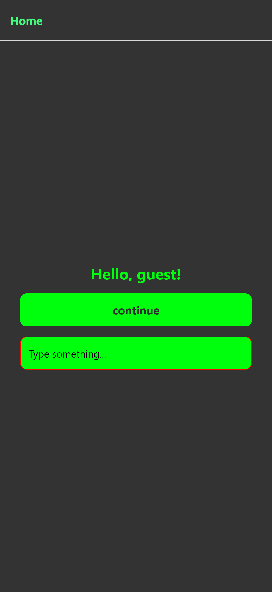
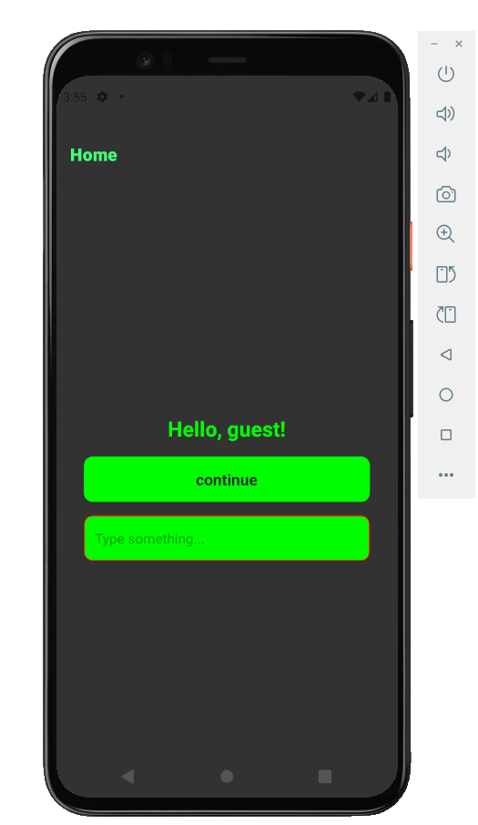

# React Native App
[Portuguese README](README.md)

This project is a simple application created to test and practice concepts learned in React Native.

<p align="center">
  
  
</p>

## Features
- Home screen with personalized greeting
- Controlled input to type the user's name
- Button to navigate between screens using Expo Router
- Dashboard screen with navigation back to the home screen

## Technologies Used
- [React Native](https://reactnative.dev/)
- [Expo](https://expo.dev/)
- [Expo Router](https://expo.github.io/router/)
- TypeScript

## How to run the project
1. Install dependencies:
   ```sh
   npm install
   ```
2. Start the project:
   ```sh
   npm start
   ```
   or
   ```sh
   npx expo start
   ```
3. Use an Android/iOS emulator or Expo Go to test the app.

## Basic structure
- `app/` - Main application screens
- `components/` - Reusable components (e.g., button)
- `input/` - Custom input component
- `assets/` - Images and fonts

---
Project created for study and practice purposes with React Native.
